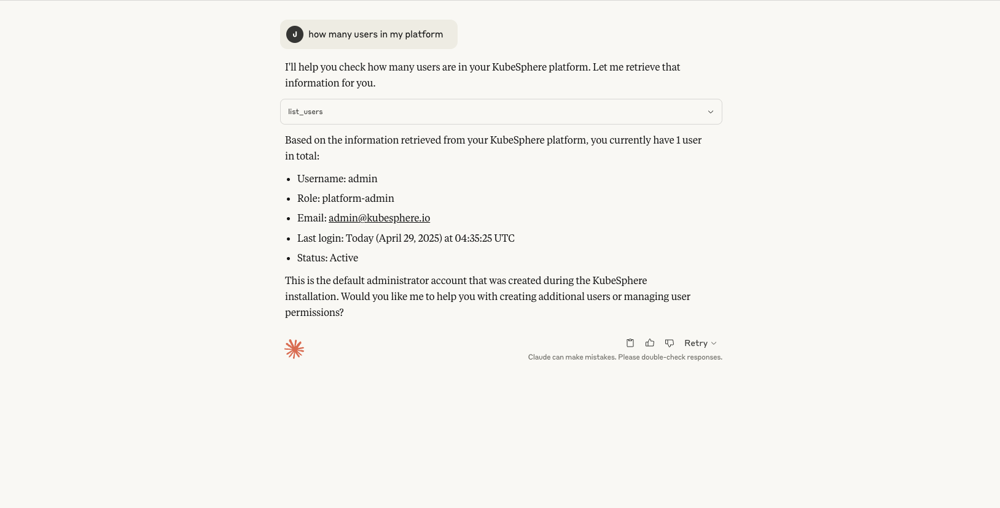

# KubeSphere MCP Server
The KubeSphere MCP Server is a [Model Context Protocol(MCP)](https://modelcontextprotocol.io/introduction) server that provides integration with KubeSphere APIs, enabling to get resources from KubeSphere. Divided into four tools modules: `Workspace Management`, `Cluster Management`, `User and Roles`, `Extensions Center`.

## Prerequisites
You must have a KubeSphere cluster. contains: Access Address, Username, Password.

## Installation
### Generate KSConfig
The format is similar to kubeconfig. This configuration contains HTTP connector information. The default context for KubeSphere is `kubesphere`, which can be modified via the environment variable `KUBESPHERE_CONTEXT`.
```yaml
apiVersion: v1
clusters:
- cluster:
    certificate-authority-data: <CA file>
    server: <Server Address>
  name: kubesphere
contexts:
- context:
    cluster: kubesphere
    user: admin
  name: kubesphere
current-context: kubesphere
kind: Config
preferences: {}
users:
- name: admin
  user:
    username: <KubeSphere Username>
    password: <KubeSphere Password>
```
`<CA file>`: **Optional**. Fill in the CA certificate in base64-encoded format when KubeSphere is accessed via HTTPS.    
`<Server Address>`: **Required** Must be an HTTPS address. (If using HTTP, enter any HTTPS address here, then modify via the parameter `--ks-apiserver http://xxx`)    
`<KubeSphere Username>`: **Required** The user for the KubeSphere cluster.    
`<KubeSphere Password>`: **Required** The password for the KubeSphere cluster user.    

### Get ks-mcp-server binary
you can run command `go build -o ks-mcp-server cmd/main.go` or download from (github releases)[https://github.com/kubesphere/ks-mcp-server/releases]
and then move it to `$PATH`.

### Configuration MCP Server in AI Agent

#### Claude Desktop
1. According to [Claude Desktop](https://modelcontextprotocol.io/quickstart/user)
should change the MCP Configuration. like:
```json
{
  "mcpServers": {
    "KubeSphere": {
      "args": [
        "stdio",
        "--ksconfig", "<ksconfig file absolute path>",
        "--ks-apiserver", "<KubeSphere Address>"
      ],
      "command": "ks-mcp-server"
    }
  }
}
```
`<ksconfig file absolute path>`: **Required** The absolute path of the ksconfig file.        
`<KubeSphere Address>`: **Optional (but required for HTTP access)** The access address of the KubeSphere cluster, supporting either the `ks-console` or `ks-apiserver` service address (e.g., `http://172.10.0.1:30880`).   

2. chat with mcp server


####  Cursor
1. According to [Curosr](https://docs.cursor.com/context/model-context-protocol)
should change the MCP Configuration. like:
```json
{
  "mcpServers": {
    "KubeSphere": {
      "args": [
        "stdio",
        "--ksconfig", "<ksconfig file absolute path>",
        "--ks-apiserver", "<KubeSphere Address>"
      ],
      "command": "ks-mcp-server"
    }
  }
}
```
`<ksconfig file absolute path>`: **Required** The absolute path of the ksconfig file.        
`<KubeSphere Address>`: **Optional (but required for HTTP access)** The access address of the KubeSphere cluster, supporting either the `ks-console` or `ks-apiserver` service address (e.g., `http://172.10.0.1:30880`).    

2. chat with mcp server

